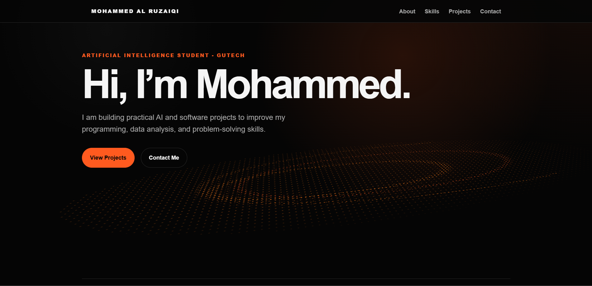
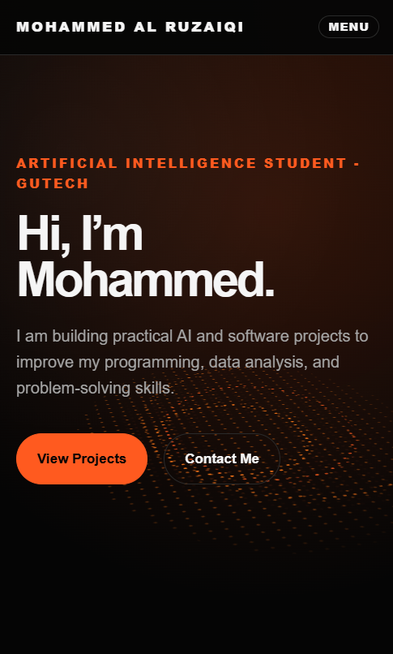

# Personal Portfolio Website

## Overview

This is my personal portfolio website built with HTML, CSS, and basic JavaScript. It introduces who I am, the skills I am currently learning, and the projects I am building as an Artificial Intelligence student.

The design uses a dark editorial style with an orange accent color, numbered section labels, archive-style project rows, and a CSS-based dot-wave hero visual.

## Live Demo

Live site: https://www.alrizeiqi.com

## Features

* Sticky navigation header
* Responsive layout for desktop, tablet, and mobile screens
* Mobile menu button for small screens
* Active navigation highlight while scrolling
* Hero section with CSS dot-wave visual
* About section
* Skills section
* Projects section
* Contact section with GitHub, LinkedIn, and email links
* Clean dark/orange editorial visual style

## Tech Stack

* HTML
* CSS
* JavaScript
* Git
* GitHub

## Screenshots

### Desktop



### Mobile



## How to Run Locally

1. Clone the repository:

```bash
git clone https://github.com/alruzaiq1/personal-portfolio-website.git
```

2. Open the project folder:

```bash
cd personal-portfolio-website
```

3. Open `index.html` in a browser.

You can also use the Live Server extension in Visual Studio Code.

## Project Structure

```text
personal-portfolio-website/
├── index.html
├── style.css
├── script.js
├── README.md
├── .gitignore
└── screenshots/
```

## What I Learned

While building this project, I practiced:

* Writing semantic HTML sections
* Structuring a static website with `header`, `main`, `section`, and `footer`
* Styling a responsive layout with CSS
* Using CSS variables for colors, spacing, and consistent design
* Creating a custom visual effect with CSS pseudo-elements
* Building a mobile navigation menu with JavaScript
* Updating navigation link styles based on scroll position
* Debugging layout issues using browser developer tools
* Using Git and GitHub to track project progress

## Challenges

Some parts of the project required extra debugging and cleanup:

* Making the mobile navigation menu open and close correctly
* Fixing duplicate navigation markup in the HTML
* Making the active navigation underline update correctly while scrolling
* Ensuring the Contact section becomes active at the bottom of the page
* Cleaning overlapping responsive CSS after adding the mobile menu
* Keeping the design distinctive without adding frameworks, canvas, WebGL, or complex animations

## Future Improvements

* Add real project links when the planned projects are completed
* Add project screenshots
* Add a downloadable CV
* Improve accessibility with more detailed testing
* Update the portfolio as new projects are finished

## Status

The portfolio website is complete as a first version and ready for deployment with GitHub Pages.
